# The Ship, The Ship, The Ship is on Fire
*Solution Guide*

## Overview

In this challenge, you will use the provided Kali Linux machine to explore and exploit various SCADA systems, gather data about the local network, and restore services using defensive tools and techniques.

This is an infinity-style challenge, so the answers you see will not necessarily match exactly those found in the solution guide.

Monitoring and visibility into the network cannot be overstated.  Spend the time necessary to understand and use SecurityOnion for its intended purposes.

> Throughout this guide, we have provided notional statistics for some steps as if we had backend data supporting how many users have successfully completed portions of the activity.  Statistics will read similar to: “Congratulations, only 75% of participants have made it this far!  Keep going.”  This will help contribute to the gamification of the challenge, give participants an appreciation of their level of achievement, and encourage them to return next year.

## Admin Notes

> TIP: The Kali Linux VM is low on resources.  Participants must use caution when processing very large PCAP files.  Wireshark will crash when under-resourced.

> TIP: Copying and pasting in and out of the environment is tricky. See the screenshot below for details and learn the process up front, so you don’t get hung up throughout the challenge!


_Admin Image 1: Copy and Paste Guidance_

## Getting Started
Once logged in, be sure to read all of the instructions prior to starting the virtual machines, kali and securityonion-v5-111.
vmast

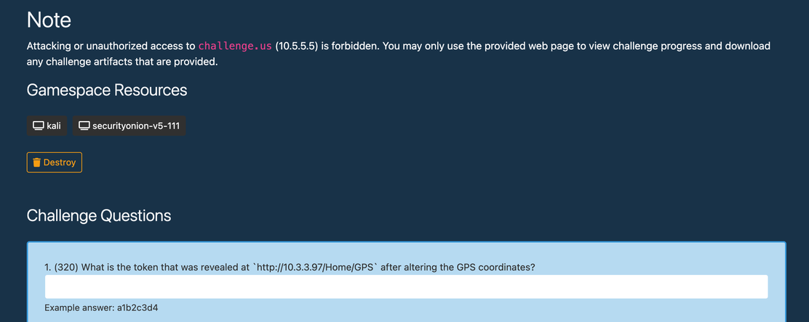

_Getting Started Image 1: Virtual Machine start location_

Reference the necessary system credentials to log in to each machine prior to starting the first challenge question.

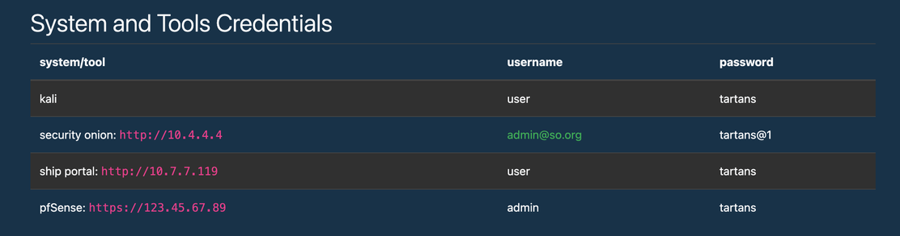

_Getting Started Image 2: System and Tools Credentials found on instructions page_

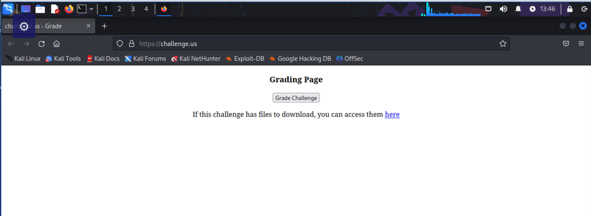

_Getting Started Image 3: Kali Linux box with FireFox grading page_

> TIP: The Kali Linux VM can be used as the primary operational workspace.

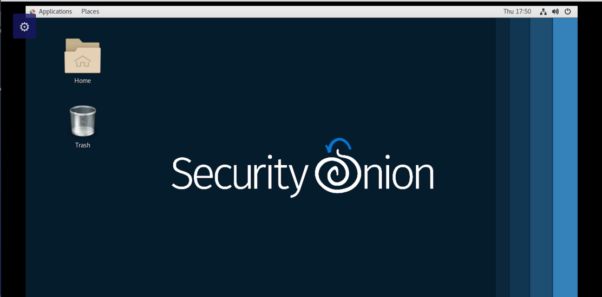
_Getting Started Image 4: Security Onion box_

## Challenge Questions

### 1. (320) What is the token that was revealed at `http://10.3.3.97/Home/GPS` after altering the GPS coordinates?
_Example answer: a1b2c3d4_

**Summary:** To answer this challenge, you must pull a PCAP from SecurityOnion and replay that traffic using Wireshark.  In Wireshark, you are looking for any devices communicating with 10.3.3.97 and the ports/services those devices are using.  You should notice interesting traffic from 10.1.1.200:11111 to 10.3.3.97. Once you select a packet transferred between these IP addresses, you will see a message containing the current broadcasting coordinates in the HEX window (ex. 37.233334,-115.808334).  This tells us that the original coordinates are coming from 10.1.1.200 over port 11111, and 10.3.3.97 is using them to display the GPS coordinates on the website. Finally, you must spoof the originating traffic using a packet generator to flood the GPS website with the new coordinates. For this challenge, we selected Scapy, because it is native to Kali Linux and has wide support in the community.

> For more information on Scapy:  <https://scapy.net/>

#### Step 1:  Create and import PCAP file to discover hosts communicating with the target (10.3.3.97):

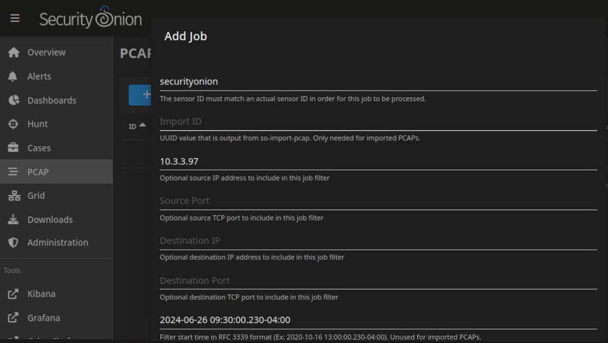

_Image 1: SecurityOnion PCAP portal_

> TIP: The filter syntax is specific.  Make sure you don’t have any extra spaces: (Ex: 2020-10-16 15:30:00.230-04:00)

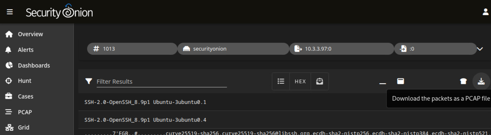

_Image 2: Download the PCAP file to Kali Linux_

### Step 2:  Analyze the Wireshark traffic for communications to the target (10.3.3.97):

Initially, we saw two IP addresses communicating with the target (10.5.5.5 and 10.1.1.200).  The traffic between the target and 10.1.1.200 is interesting because it's persistently communicating over UDP on port 11111.  This represents a packet flood and is unusual behavior on a network. Selecting a packet between these IP addresses identifies the coordinates we see on the website in the Hex window.wire

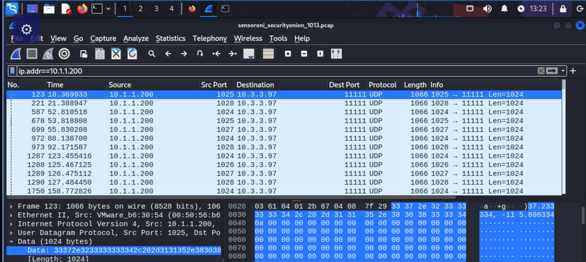

_Image 3: PCAP file opened in Wireshark revealing the coordinates message_

> TIP: It’s important to note that the Game Board (10.5.5.5) is off-limits and can be filtered out using Wireshark’s display filters (e.g. ip.addr!=10.5.5.5)

### Step 3:  Craft a UDP packet to spoof the original signal from the remote host (10.1.1.200):

In this step, we need to force the website to use the new coordinates we are going to provide it.  We know that the target will take data from 10.1.1.200 over port 11111.  We need to spoof that source IP and send new coordinates to the target.  For this task, we will use Scapy to generate a UDP packet with the new coordinates and spoof the original IP address.  Additionally, we need to send the packets to the target as fast as possible and continuously (100x).  The original traffic shows a flood of packets sent to the target.  We must match or exceed the speed and frequency of packets to ensure our coordinates persist. Once sent, refresh the GPS website to see the new coordinates and your token.

```python
sudo scapy
>>> sendpfast(Ether()/IP(src="10.1.1.200",dst="10.3.3.97")/UDP(dport=11111)/Raw(load="32.943241, -106.419533"),loop=100,mbps=1000)
```

> For more information on Scapy:  <https://scapy.net/>

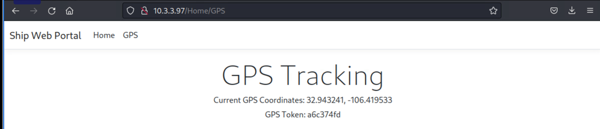

_Image 4: Result of spoofed GPS coordinates, Token Obtained._

> Congratulations! You got the first Token! 110 out of 200 Participants also got this token!

You can also view the “Challenge Question 1” Video Here:

[](https://www.youtube.com/watch?v=ICRx0Jxis0o)

## 2. (480) What is the token revealed on http://challenge.us after modifying the CAN Bus data for the antenna system?

_Example answer: a1b2c3d4_

**Summary:** This challenge is more involved than the others.  It requires running a python script to change the values of the antenna’s position. We must connect to the python-can website to see the current positioning data.

### Step 1: Navigate the challenge instructions to find IP address and port
In the challenge instructions for Token 2, we are given the IP address to connect to.  What we’re missing is the port we need to connect to.  The challenge instructions also provide an example script to use (challenge.us/files/remote-can-bus-.txt). In that example, port 54701 is referenced.  We can now connect to the python-can remote interface. Navigate to http://10.3.3.223:54701, and click the ‘play’ button to display the current positioning data.

> Additional information can be found here: <https://github.com/christiansandberg/python-can-remote>

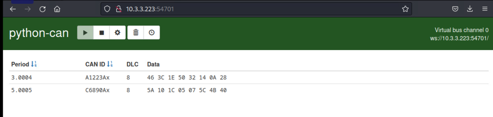

_Image 5: http://10.3.3.223:54701_

### Step 2: Determine proper data values and modify remote-can-bus script
Now that we can see the positioning data, we must modify the provided remote-can-bus.txt script to connect to the target and transmit the new data.  The challenge instructions told us to modify the values by increasing the current data values for CAN ID: A1223Ax by 11.

The initial set of data provided were hex values: **46 3C 1E 50 32 14 0A 28**. These values must be converted to decimal, incremented by 11, and substituted for the original values (the application converts the binary numbers to hex).  There are numerous tools online to convert hex-to-binary and visa versa.  Use a conversion chart to convert each hex value to its corresponding binary value.

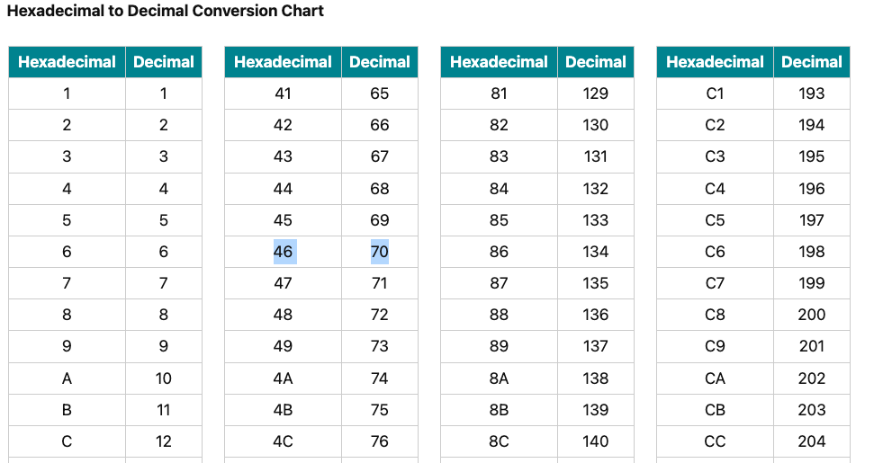

_Image 6: Example Hex-to-Decimal Conversion Chart_

Hex conversion to binary: 70 60 30 80 50 20 10 40

Binary +11: 81 71 41 91 61 31 21 51

### Step 3: Add values to the remote-can-bus script, and run
Now that we have the properly converted binary data values, we must add them to the data array in the provided script.
> TIP: Save the file with a .py extension instead of .txt.py

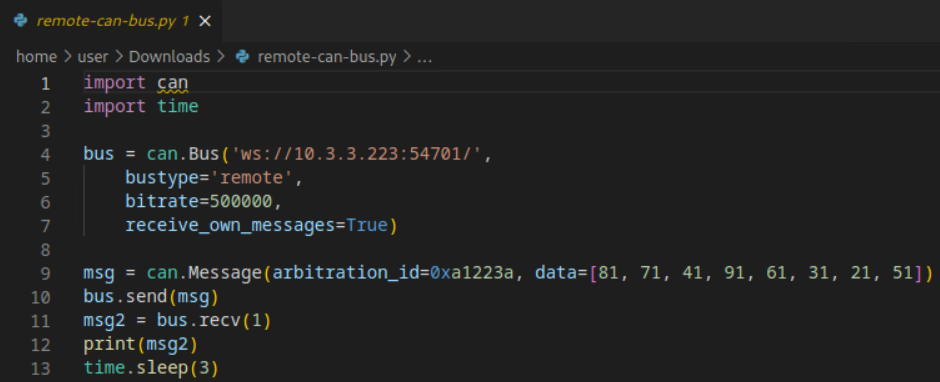

_Image 7: remote-can-bus.py script_

Run the script with the below python command, and observe the A1223Ax channel’s data change.

> TIP: Remember to exclude the file extension when running this script.

```python
python -m /path/to/file --interface=virtual --channel=0 --bitrate=500000
```

### Step 4: Create persistence for remote-can-bus script
Unfortunately, the data does not remain changed.  We need to modify our script to send the bus message with the new data persistently to ensure the data remains changed.  There are many ways to add this functionality to the script.  We chose to add a while loop and change the ‘time.sleep’ value to 0.  Now, we are able to send the data persistently and earn the token.

**Remote-can-bus Script**

```python
import can
import time
bus = can.Bus('ws://10.3.3.223:54701/',
    bustype='remote',
    bitrate=500000,
    receive_own_messages=True)
msg = can.Message(arbitration_id=0xa1223a, data=[81, 71, 41, 91, 61, 31, 21, 51])
try:
    while True:
        #send the CAN message
        bus.send(msg)
        #receive the CAN message
        msg2 = bus.recv(1)
        if msg2:
            print(msg2)
        else:
            print("No messge")
        #pause
        time.sleep(0)
except KeyboardInterrupt:
    print("Program terminated")
finally:
    bus.shutdown()
```
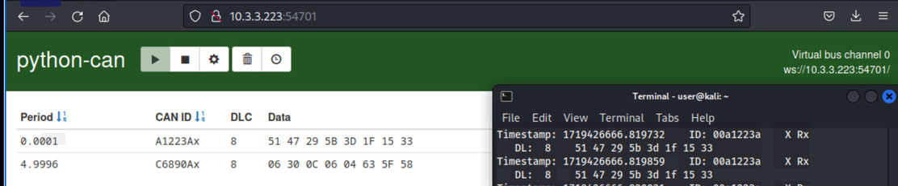

_Image 8: Results while running script_

Final Hex values from python-can-remote interface: **51 47 29 5B 3D 1F 15 33**

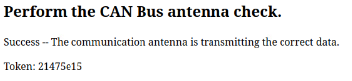

_Image 9: Antenna correctly transmitting, Token Obtained._

> Congratulations! You obtained the second Token! Only 77% of participants have made it this far!

You can also view the “Challenge Question 2” Video Here:

[](https://youtu.be/ft8QmZwnzBk)

## 3. (480) What is the token revealed on http://challenge.us after activating the fire suppression system?
_Example answer: a1b2c3d4_

**Summary:** To satisfy this challenge, you must pull a PCAP file using SecurityOnion and replay that traffic using Wireshark.  In Wireshark, you are looking for any devices communicating with 10.7.7.119 and the ports/services they are using. We know from experience that physical devices that control doors and suppression systems are typically connected to special networks called industrial control systems (ICS) and often managed by Supervisory Control and Data Acquisition (SCADA) systems.  Those devices communicate using different ports and protocols (e.g., Modbus (502), dnp3 (20000)).

Provided on the Kali Linux desktop is an application called “ctmodbus”.  We can use this to connect to ICS devices.  From the PCAP file, we see multiple devices communicating with our target system. Interestingly, one IP address (10.3.3.200) is communicating using port 502 (Modbus). This gives us a device to connect to using the ctmodbus application.

The image provided by the challenge (challenge.us/files/Ship_diagram.png) outlines the number and purpose of the coils that correspond to the ship's doors, suppression system, and smoke detectors.

Using the ctmodbus application connected to the 10.3.3.200 device over TCP to port 502, we can now write to the appropriate coils to close the correct doors and activate the fire suppression system.

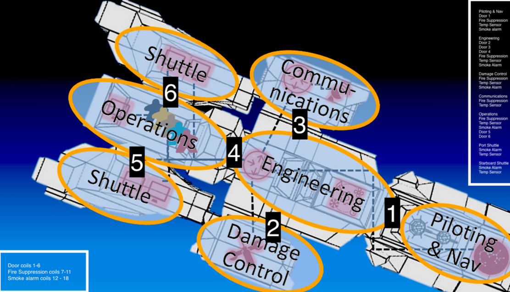

_Image 10: Ship_diagram.png_

### Step 1:  Create and import PCAP file to discover hosts communicating with the target (10.7.7.119):

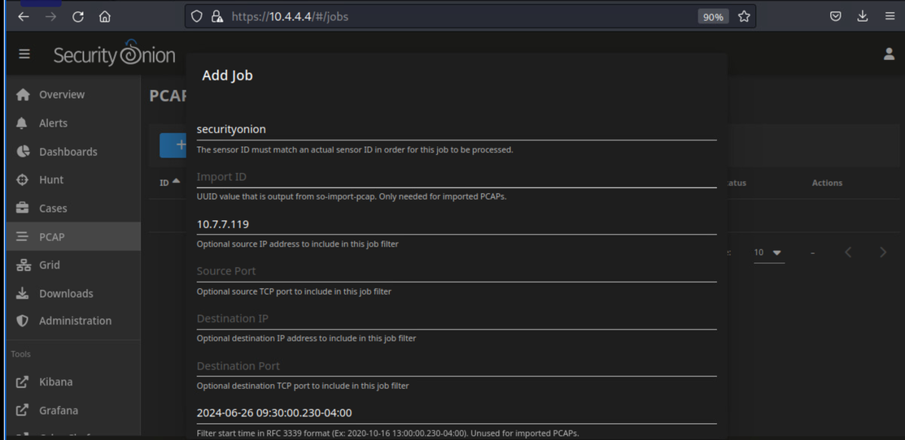

_Image 11: Create PCAP file from Source IP 10.7.7.119_


_Image 12: Download the PCAP file to Kali Linux_

### Step 2:  Analyze traffic in Wireshark for communications to the target (10.7.7.119)

Observe Modbus traffic within the PCAP.  Identify all devices communicating on port 502.  Note the traffic coming from 10.3.3.200

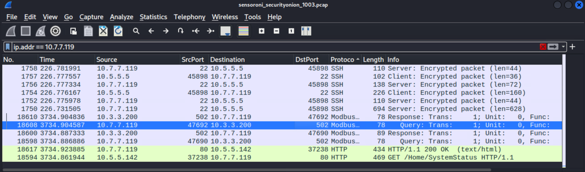

_Image 13: Modbus Traffic to/from Target and 10.3.3.200_

> Congratulations! Finding and identifying ICS/SCADA traffic is harder than it looks! You earned a level up with the completion of this step!

### Step 3:  Use ‘ctmodbus’ to Connect and Modify Coils

Using the ‘ctmodbus’ application, connect via TCP to Master device (10.3.3.200:502) and write coils 4, 5, and 11 (1).

> TIP: Reading/writing coils to other Modbus devices does not result in the required changes for this challenge.

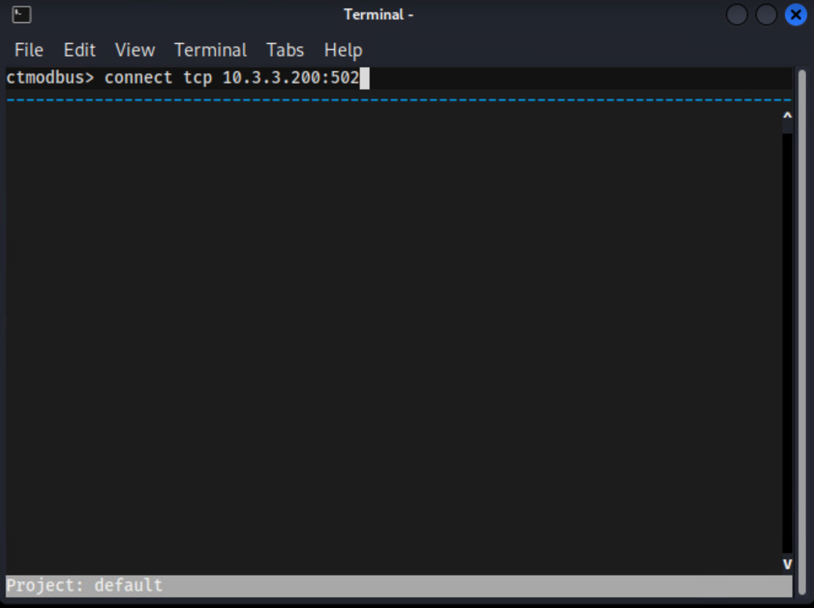

_Image 14: Connect to Master via TCP/502_

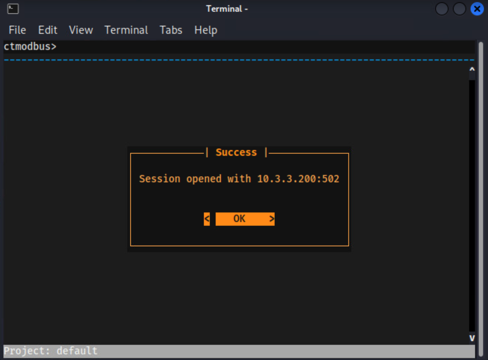

_Image 15: Successfully connected to Master_

 to close doors and enable fire suppression")

_Image 16: Successful write to coils 4,5, and 11 (1) to close doors and enable fire suppression_

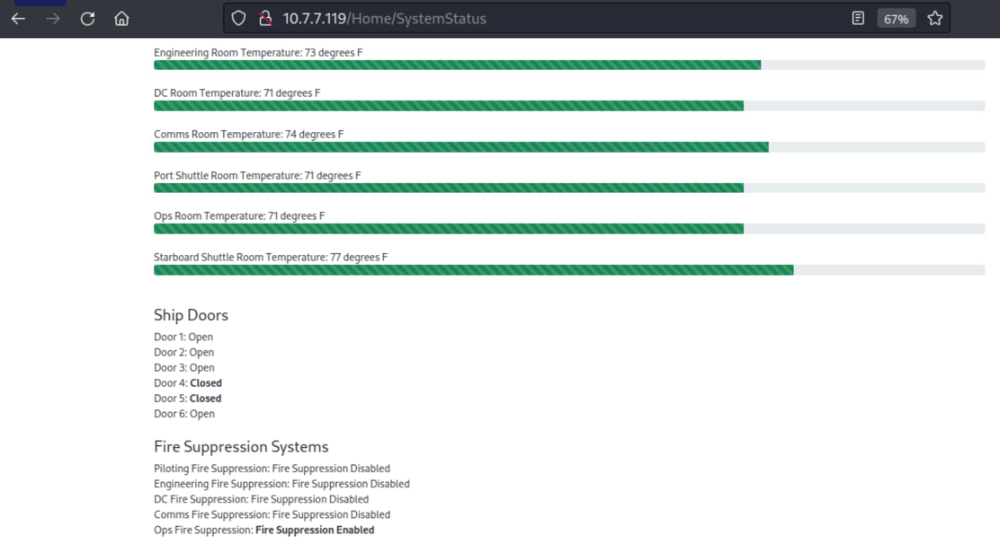

_Image 17: Final Results_

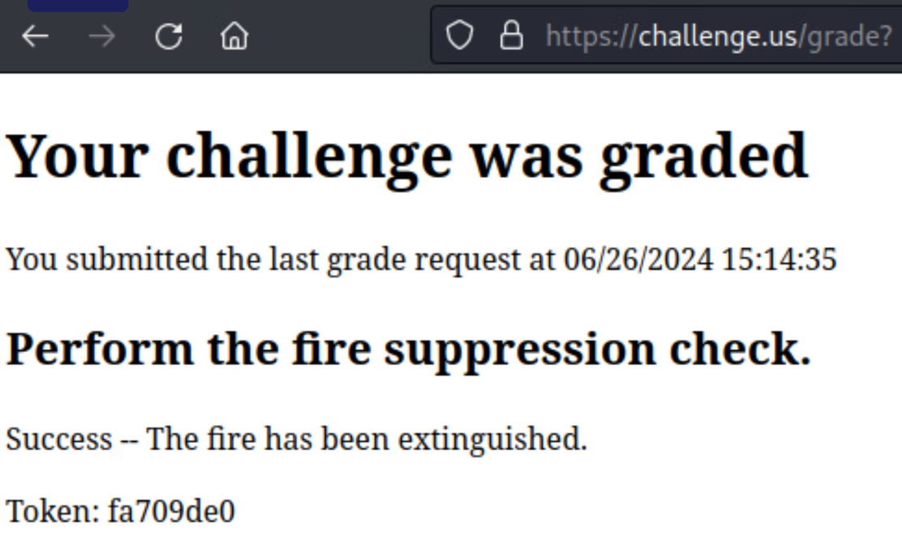

_Image 18: Fire extinguished, Token obtained._

> Congratulations! You got the third Token! Only 50% of participants have been successful at extinguishing the fire!

You can also view the “Challenge Question 3” Video Here:

[](https://youtu.be/dA8UnkY7xr4)

## 4. (320) What is the token embedded in the WebSocket data?
_Example answer: a1b2c3d4_

> While our team was not able to solve this challenge, outlined below is our methodology and explanation of our approach to solving it.

### Methodology

We pulled PCAP using SecurityOnion for all traffic over a 30-minute session.  This was a limitation imposed by the lack of resources on Kali Linux’s Wireshark.  Wireshark consistently crashed when processing more than this amount of packets.

### Approach 1:  Observe any WebSocket traffic in PCAP

The only WebSocket traffic identified in PCAP was between 10.3.3.223 and 10.5.5.142 (Kali Linux).  However, the challenge explicitly stated that this solution would not come from any source referenced in Token 2.

Attempt 1:  Filter for WebSocket in the display filter

Attempt 2:  Filter for port 8080 traffic in the display filter

Attempt 3:  Filter for data-text-lines packets in the display filter

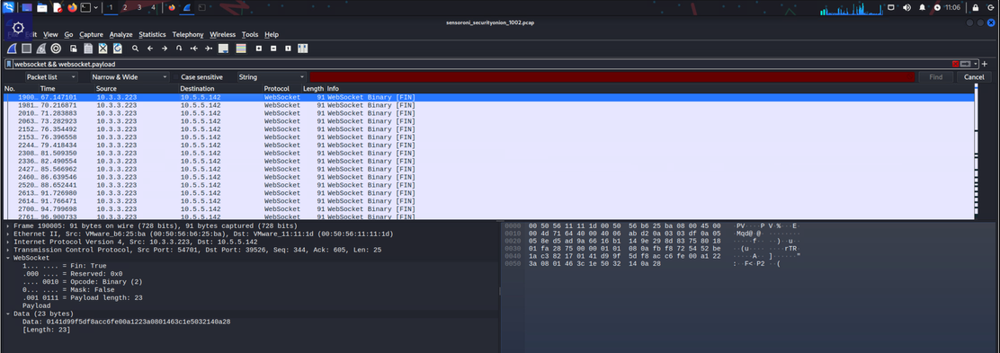

_Image 19: Wireshark display filter for WebSocket data_

### Approach 2:  Observe WebSocket connections using inspect tool on known devices
We opened the ‘inspect’ tool and selected “WS” inside the network tab to observe any ws:// connections for all known devices.

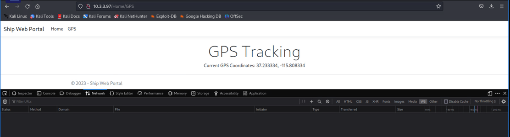

_Image 20: Example website with no WebSocket connections_

WebSocket traffic was noted using this approach on 10.3.3.223.  However, the challenge explicitly stated that this solution would not come from any source referenced in Token 2.

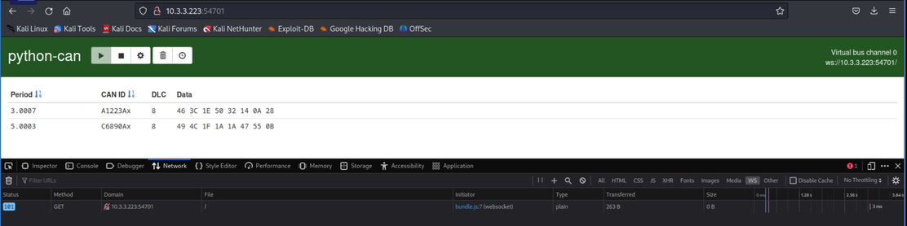

_Image 21: Identified WebSocket connection on 10.3.3.223_

> Congratulations on your attempts in this challenge! If you were able to make it past the fourth challenge, we invite you to contribute to our guide by contacting support@teamworxsecurity.com. Thanks again for competing in this year’s President’s Cup!!!
